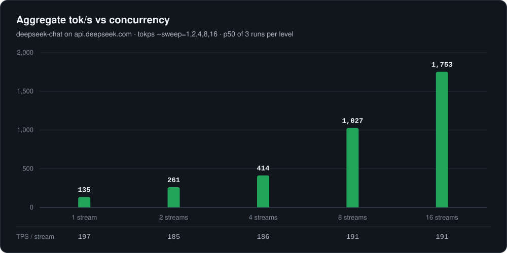

<p align="center">
  
</p>

<p align="center">
  <a href="https://github.com/canergulay/tokps/releases"></a>
  <a href="https://pkg.go.dev/github.com/canergulay/tokps"></a>
  <a href="https://go.dev/"></a>
  <a href="go.mod"></a>
  <a href="https://github.com/canergulay/tokps/pkgs/container/tokps"></a>
  <a href="LICENSE"></a>
</p>

<p align="center">
  <b>Time-to-first-token and tokens/sec for any OpenAI-compatible endpoint.</b><br>
  Benchmark one model, sweep it under load, race providers against each other, gate your CI.<br>
  One static binary · zero dependencies · honest statistics.
</p>

<p align="center">
  <a href="#install">Install</a> ·
  <a href="#usage">Usage</a> ·
  <a href="#comparing-providers">Compare providers</a> ·
  <a href="#reasoning-models">Reasoning models</a> ·
  <a href="#ci-gates">CI gates</a> ·
  <a href="#why-tokps">Why tokps</a> ·
  <a href="#how-it-measures">How it measures</a>
</p>

<p align="center">
  
</p>

## Install

```sh
go install github.com/canergulay/tokps@latest
```

This drops a `tokps` binary in `$(go env GOPATH)/bin`. Make sure that's
on your `PATH`.

Or run the published image without installing Go:

```sh
docker run --rm -e API_KEY ghcr.io/canergulay/tokps:latest \
  --url https://api.openai.com/v1 --model gpt-4o-mini
```

Or build from source:

```sh
git clone https://github.com/canergulay/tokps
cd tokps
go build -o tokps .
```

## Usage

tokps picks up the key variable your provider's SDK already uses —
`OPENAI_API_KEY`, `DEEPSEEK_API_KEY`, `GROQ_API_KEY`, … (see
[API keys](#api-keys)) — or the provider-agnostic `API_KEY`:

```sh
# OpenAI
tokps --url https://api.openai.com/v1 --model gpt-4o-mini

# DeepSeek
tokps --url https://api.deepseek.com --model deepseek-chat

# Z.ai / GLM
tokps --url https://api.z.ai/api/paas/v4 --model glm-5.2

# A local OpenAI-compatible server (e.g. llama.cpp, vLLM, Ollama)
tokps --url http://localhost:8080/v1 --model my-local-model
```

The base URL has `/chat/completions` appended automatically, so `…/v1` and
`…/paas/v4` both work. If you pass a full `…/chat/completions` URL it's used
as-is.

Here's what a run prints:

```text
tokps — glm-5.2 @ api.z.ai  (5 runs, 1 warmup)

  prompt tokens     39
  output tokens     200   (exact, median)

  TTFT     p50 2.61s   range 2.41s–2.95s
  TPS      p50 73.1   range 69.8–75.4   (generation, N-1)
  e2e      p50 36.8   range 34.1–38.0   (incl. TTFT)
```

For a single cheap request, pass `--runs 1 --warmup 0` — the output falls back
to a detailed single-shot block (per-run TTFT, generation, and total wall).

### Flags

| Flag | Default | Description |
|------|---------|-------------|
| `--url` | *(required)* | Base URL of the endpoint. Optional when every `--target` carries its own. |
| `--model` | *(required)* | Model name. A comma-separated list (`--model a,b,c`) benchmarks each and prints a comparison table. |
| `--target` | — | `model@url[#KEY_VAR]`, repeatable — compare models across providers. Replaces `--url`/`--model`. |
| `--api-key` | see [API keys](#api-keys) | Bearer token. Flag wins over env. |
| `--prompt` | built-in | Override the test prompt. |
| `--max-tokens` | `512` | Upper bound on output length. |
| `--max-tokens-field` | `max_tokens` | Field carrying the output cap: `max_tokens` or `max_completion_tokens` (newer OpenAI models). Auto-falls back when the endpoint rejects `max_tokens`. |
| `--runs` | `5` | Number of timed runs; reports p50 + min–max across them. |
| `--warmup` | `1` | Discarded warmup runs before measuring (absorbs cold start). |
| `--detail` | `false` | Also show inter-chunk latency (ITL) p50/p95. |
| `--json` | `false` | Emit machine-readable JSON instead of the text summary. |
| `--concurrency` | `1` | Parallel streams per run; >1 reports aggregate tok/s under load. |
| `--sweep` | — | Concurrency levels to sweep: bare `--sweep` = `1,2,4,8`, or `--sweep=1,2,4,8`. |
| `--timeout` | `60s` | Per-request timeout. |
| `--cost-in` | `0` | Input token price in USD per 1M tokens; adds a per-request cost line. |
| `--cost-out` | `0` | Output token price in USD per 1M tokens; adds a per-request cost line. |
| `--chars-per-token` | `4` | Chars-per-token ratio for the estimated fallback (CJK ~ 1.5–2). |
| `--extra-body` | — | JSON object merged into the request body, e.g. `'{"temperature":0}'` or a provider's thinking toggle. Your keys win. |
| `--md` | `false` | Emit a GitHub-flavored markdown table instead of the text summary. |
| `--quiet` | `false` | Suppress progress and warnings on stderr. |
| `--min-tps` | `0` | CI gate: exit 3 if generation TPS p50 is below this. |
| `--max-ttft` | `0` | CI gate: exit 3 if TTFT p50 exceeds this (e.g. `1.5s`). |
| `--max-error-rate` | — | CI gate: exit 3 if more than this share of streams failed (`0.05` or `5%`; `0` = none allowed). |

> Each invocation sends `--warmup` + `--runs` requests (6 by default), so it
> makes that many billable calls against a metered endpoint. Use
> `--runs 1 --warmup 0` for a single request.
>
> Interrupt with Ctrl-C and tokps stops gracefully, printing how many measured
> runs completed before the signal (exit code 130) — a long benchmark won't
> hang, and you'll know how far it got.

Run `tokps` with no flags to see the full list.

## Why tokps

Provider dashboards quote peak numbers; your users feel the p50. tokps
measures what actually reaches your client — OpenAI, DeepSeek, Z.ai / GLM,
Groq, OpenRouter, vLLM, llama.cpp, Ollama, a custom gateway, anything that
speaks `/chat/completions`.

| | |
|---|---|
| ⚡ **The two numbers that matter** | Time to first token and generation tok/s, using the standard *N − 1* definition from vLLM, genai-perf and llmperf. |
| 📊 **Statistics, not anecdotes** | A discarded warmup, then 5 timed runs reported as p50 + min–max, so one cold start can't skew the result. |
| 🧠 **Reasoning-aware** | Splits thinking from answer tokens and reports *time to first answer*, the wait your users actually feel. Hidden reasoning (o-series, gpt-5) can't inflate TPS. |
| 🏁 **Cross-provider races** | `--target model@url` repeated: same prompt, interleaved runs, one table. Picks up each provider's own key variable. |
| 📈 **Load sweeps** | `--sweep=1,2,4,8,16` draws the throughput-vs-concurrency curve and finds where an endpoint saturates. |
| 🚦 **CI gates** | `--min-tps`, `--max-ttft`, `--max-error-rate` exit with code 3 when a deploy gets slower. |
| 🧾 **Pipes anywhere** | `--json` for machines, `--md` for PRs and issues, plain text for humans. |

## How it measures

Each request is sent with `stream: true` and `stream_options.include_usage:
true`. As chunks arrive, tokps records:

- **time to first token (TTFT)** — request send → first generated token.
- **generation time** — first → last generated token.
- **total wall** — request send → last token.

It reports two throughput numbers:

- **TPS (headline)** = `(output tokens − 1) ÷ generation time`. The first token
  is produced during TTFT, so the first-to-last window spans *N − 1* token
  intervals — dividing by `N − 1` is the standard serving-benchmark definition
  (vLLM, NVIDIA genai-perf, Anyscale llmperf) and the inverse of mean
  inter-token latency. This is the pure decode rate, excluding initial latency.
- **end-to-end** = `output tokens ÷ total wall`, which folds in TTFT.

**Runs and percentiles.** A model's speed varies run to run (cold replicas,
queueing, KV-cache state, network jitter). So tokps runs `--warmup`
discarded requests, then `--runs` timed ones, and reports the **median (p50)**
and the **observed min–max range** for each metric. Min/max are reported rather
than p90/p99 because they're unambiguous for both latency (higher = worse) and
throughput (higher = better), and don't oversell percentile resolution at small
run counts.

**Token counts** come from the stream's `usage` field when the server sends it
(labeled `exact`). If a server omits it, tokps estimates from the streamed
text length at ~4 chars/token (labeled `estimated`) — model-agnostic and
independent of how the server chose to chunk the stream.

### Detail and JSON output

`--detail` adds an **inter-chunk latency (ITL)** line — the p50 and p95 of the
gaps between successive content-bearing SSE chunks, pooled across runs. A chunk
can carry more than one token (servers batch arbitrarily), so ITL is exact only
when the server streams one token per event and otherwise an upper bound on
per-token latency. p95 surfaces stalls/jitter that a single averaged rate hides.

`--json` emits the full result as machine-readable JSON instead of the text
table — the p50/min/max for every metric, ITL, and a `runs_detail` array with
each run's raw numbers — for CI gates, storing, and diffing over time.

### Concurrency and load

By default tokps measures a single stream — the "how fast is one response"
question. `--concurrency N` instead fires **N streams in parallel** per run and
adds an **aggregate tok/s** line (total output tokens across all streams ÷ wall
time) alongside the per-stream TTFT/TPS distribution — i.e. throughput under
load.

`--sweep=1,2,4,8` runs the benchmark at each level in turn and prints the
**throughput-vs-concurrency curve**, so you can see where an endpoint saturates
(a bare `--sweep` uses the default `1,2,4,8` curve):

```text
tokps — deepseek-chat @ api.deepseek.com  (sweep, 3 runs, 1 warmup)

  concurrency   aggregate tok/s (range)    TTFT p50 (range)         TPS p50/stream   errors
  1             135.0 (122.5–156.3)        0.60s (0.39s–0.79s)      197.1            –
  2             261.4 (246.4–265.5)        0.57s (0.51s–0.68s)      184.6            –
  4             414.0 (390.2–513.6)        0.65s (0.36s–1.04s)      185.8            –
  8             1026.8 (904.5–1074.8)      0.56s (0.39s–0.91s)      191.1            –
  16            1753.2 (1741.1–1873.0)     0.65s (0.36s–0.99s)      191.2            –
```

<p align="center">
  
</p>

That DeepSeek run hasn't saturated at 16 streams: aggregate throughput keeps
climbing while each stream holds ~190 tok/s. When an endpoint does saturate,
the aggregate column flattens and the per-stream TPS starts to fall.

### Cost

Pass `--cost-in` and `--cost-out` (USD per 1M tokens) and tokps adds a
per-request cost line — the median across runs — plus a per-run `cost_usd` in
`--json` output. Combined with TPS it doubles as a provider comparison: which
endpoint gives the best dollars-per-token throughput.

### Comparing models

Give `--model` a comma-separated list and tokps benchmarks each model
against the same endpoint, then prints one row per model:

```text
tokps — compare @ api.z.ai  (5 runs, 1 warmup)

  model         TTFT p50   TPS p50 (range)       e2e p50   cost/req   errors
  glm-5.2       2.61s      73.1 (69.8–75.4)      36.8      $0.0013    –
  glm-5-flash   0.41s      118.2 (110.0–121.9)   101.3     $0.0002    –
```

All warmups run first, then the measured runs are **interleaved**
(A,B,C, B,C,A, C,A,B …) rather than all of A before any of B, so load drift on
the endpoint — or on your own network — hits every model equally.

`--json` emits an array of the usual per-model objects; `--md` a markdown
table. `--concurrency` applies to every model; `--sweep` cannot be combined
with a comparison.

### Comparing providers

`--target model@url` (repeatable) compares models on *different* endpoints —
the question "which provider is actually fastest for me?":

```sh
tokps --target gpt-4o-mini@https://api.openai.com/v1 \
      --target deepseek-chat@https://api.deepseek.com \
      --target 'llama-3.3-70b@http://gpu-box:8000/v1#LOCAL_KEY'
```

Output looks like this (illustrative numbers):

```text
tokps — compare  (5 runs, 1 warmup)

  target                              TTFT p50   TPS p50 (range)        e2e p50   errors
  gpt-4o-mini @ api.openai.com        0.38s      84.2 (80.1–88.0)       71.0      –
  deepseek-chat @ api.deepseek.com    0.62s      211.3 (209.4–213.2)    194.5     –
  llama-3.3-70b @ gpu-box:8000        0.09s      41.7 (41.5–41.9)       40.9      –
```

Each target uses its own key (see below); `#VAR` names it explicitly. A
`--target` without `@url` uses `--url`. Model names that contain `@`
themselves (Cloudflare's `@cf/meta/…`) work: the URL starts at the first `@`
followed by something URL-shaped. Pass the same model on two hosts to
compare providers serving one open-weights model.

### API keys

For each endpoint tokps uses the first key it finds:

1. `#VAR` on a `--target` (`model@url#MY_KEY`)
2. `--api-key`
3. the provider's own variable for the URL's host — `OPENAI_API_KEY`
   (api.openai.com), `DEEPSEEK_API_KEY`, `ANTHROPIC_API_KEY`, `GEMINI_API_KEY`,
   `XAI_API_KEY`, `MISTRAL_API_KEY`, `GROQ_API_KEY`, `CEREBRAS_API_KEY`,
   `TOGETHER_API_KEY`, `FIREWORKS_API_KEY`, `OPENROUTER_API_KEY`,
   `DEEPINFRA_API_KEY`, `SAMBANOVA_API_KEY`, `PERPLEXITY_API_KEY`,
   `MOONSHOT_API_KEY`, `ZAI_API_KEY` (api.z.ai), `ZHIPUAI_API_KEY`
   (open.bigmodel.cn), `DASHSCOPE_API_KEY`
4. `API_KEY`
5. `OPENAI_API_KEY` — only for OpenAI itself and unknown hosts (local servers,
   gateways), so an OpenAI key is never sent to another known provider

### Failures under load

A stream that fails during a measured run (a `429` at high concurrency, a
transient `5xx`) is recorded rather than aborting the benchmark. The summary
gains an `errors` line, `--json` gains `streams`, `errors`, `error_rate`, and
an `errors_detail` array, and a sweep level or compared model with no
successful stream shows as `failed (429 Too Many Requests ×8)` instead of
losing everything measured so far.

```text
  errors            2/40 streams   (429 Too Many Requests ×2)
```

Two things still fail fast: a warmup error on a plain run, and — in sweep or
compare mode — any error on the first level or model, which is the canary for
auth and URL mistakes. Past the canary, a warmup batch where only some
streams failed (one 429 among eight) prints a warning and the level is
measured anyway.

### CI gates

`--min-tps`, `--max-ttft` and `--max-error-rate` turn tokps into a
deployment check: after the normal report, each violated threshold is printed
as a `FAIL:` line on stderr and the process exits with code **3**.

`--min-tps` and `--max-ttft` are checked against **successful streams
only**, so pair them with `--max-error-rate` — otherwise a run where 7 of 8
streams were 429'd can pass on the one that got through. `--max-error-rate`
takes a fraction or a percentage (`0.05`, `5%`); `0` allows no failures. A
run in which *no* stream succeeded always fails with `FAIL: no successful
streams`, and `--max-ttft` also fails when the endpoint did not stream (TTFT
is unavailable).

```sh
tokps --url http://vllm:8000/v1 --model my-model \
  --min-tps 50 --max-ttft 1s --max-error-rate 0 --quiet
```

In sweep and compare mode the thresholds apply to every level / model.

### Provider-specific request fields

`--extra-body` merges a JSON object into the request, so any provider knob
can be set without a dedicated flag — disable a reasoning model's thinking
phase, pin `temperature`, set `reasoning_effort`, and so on:

```sh
tokps --url https://api.z.ai/api/paas/v4 --model glm-5.2 \
  --extra-body '{"thinking":{"type":"disabled"},"temperature":0}'
```

Your keys override anything tokps sets.

### Progress and exit codes

On an interactive terminal tokps prints one line per completed run to
stderr (`run 3/5   72.1 tok/s`); the lines are omitted when stderr is
redirected, and `--quiet` turns them off along with warnings.

| Exit code | Meaning |
|---|---|
| `0` | success |
| `1` | request or benchmark error (including no successful stream at all) |
| `2` | usage error |
| `3` | a `--min-tps` / `--max-ttft` / `--max-error-rate` gate failed |
| `130` | interrupted (Ctrl-C / SIGTERM) |

### Reasoning models

Reasoning models such as DeepSeek, **GLM-5.2** and Qwen stream their thinking
in `delta.reasoning_content` before the answer. tokps counts those tokens
toward TPS — the model generated them — and splits them out, because what a
user waits for is the *answer*:

```text
tokps — deepseek-flash @ api.deepseek.com  (3 runs, 1 warmup)

  prompt tokens     41
  output tokens     284   (exact, median)
  thinking          190   (exact, median; answer 94)

  TTFT     p50 0.89s   range 0.85s–0.96s
  answer   p50 2.07s   range 1.86s–2.21s   (first answer token, after thinking)
  TPS      p50 192.2   range 188.0–205.1   (generation, N-1)
  e2e      p50 120.4   range 117.7–126.0   (incl. TTFT)
```

`TTFT` is the first token of any kind; `answer` is the first answer token.
The thinking count comes from `usage.completion_tokens_details` when the
server reports it (`exact`), otherwise it is apportioned by streamed text
length (`estimated`). If thinking eats the whole `--max-tokens` budget, the
`answer` line says `not reached` — raise `--max-tokens`, or turn thinking
off with `--extra-body`.

OpenAI's o-series and gpt-5 think *without streaming it*: the hidden tokens
are billed in `completion_tokens` but generated before the first visible
token. tokps excludes them from TPS (dividing them by the visible window
would overstate it many times over) and shows them as
`thinking … (hidden — not streamed, excluded from TPS)`; their thinking time
is inside TTFT.

Some newer OpenAI models reject `max_tokens` and require
`max_completion_tokens`. tokps defaults to `max_tokens` but automatically
retries with `max_completion_tokens` when the endpoint returns a 400 asking for
it — or set `--max-tokens-field=max_completion_tokens` to always use it.

### Non-streaming endpoints

If a server ignores `stream: true` and returns a single JSON object,
tokps still reports tokens (from `usage`) and total time; TTFT and the
generation-only rate are shown as `n/a` since per-token timing isn't available.

## Development

Pure Go standard library, no third-party dependencies.

```sh
go test ./...     # unit + integration tests (httptest, no network)
go vet ./...
go build ./...
```

The code is split into small, independently testable packages:

- `internal/sse` — turns an SSE byte stream into data payloads.
- `internal/bench` — builds/sends the request, drives the parser, collects
  metrics; `aggregate.go` runs warmup/measured batches and sweeps,
  `compare.go` runs model comparisons, `gate.go` checks CI thresholds,
  `errors.go` types the failure modes.
- `internal/report` — formats the text, markdown, and JSON output.

## License

[MIT](LICENSE) © Caner Gulay
